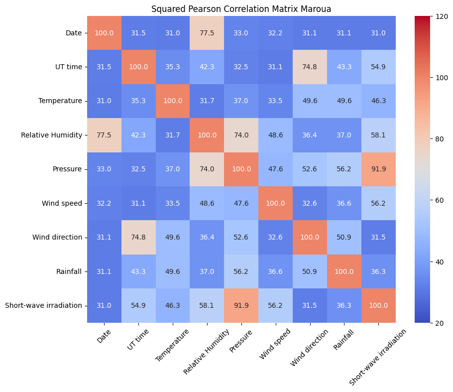

# MASTER PROJECT BY Ing. Tedom Noutchogouin Donald

## Prediction of Daily Global Solar Radiation using Different Machine Learning Algorithms: Evaluation and Comparison

### Dataset for the 10 Region of Cameroon FROM 1980 TO 2020

- **Source:** Modern-Era Retrospective Analysis for Research and Applications (MERRA), version 2
- **Provider:** National Aeronautics and Space Administration (NASA) / Goddard Space Flight Center
- **More Information:** [MERRA-2](http://gmao.gsfc.nasa.gov/reanalysis/MERRA-2)
- **Site Latitude (Positive means North):** 5.476
- **Site Longitude (Positive means East):** 10.422
- **Site Altitude (m):** 1151
- **Date Beginning:** 1980-01-01
- **Date End:** 2020-12-31
- **Time Reference (Hour):** UT
- **Summarization (Period of Integration):** Hour (h)
- **Date - Instant:** The date or instant given for each value corresponds to the end of the summarization

#### Columns:

1. **Temperature (K):** Temperature at 2 m above ground
2. **Relative Humidity (%):** Relative humidity at 2 m above ground
3. **Pressure (hPa):** Pressure at ground level
4. **Wind Speed (m/s):** Wind speed at 10 m above ground
5. **Wind Direction (deg):** Wind direction at 10 m above ground (0 means from North, 90 from East...)
6. **Rainfall (kg/m2):** Rainfall (= rain depth in mm)
7. **Snowfall (kg/m2):** Snowfall
8. **Snow Depth (m):** Snow depth
9. **Short-wave Irradiation (Wh/m2):** Surface incoming shortwave irradiation (broadband)

- **MERRA-2 Meteorological Data**

## Bafoussam Matrix correlation 

## Bafoussam Predicted vs mesured irradiation 

## Maroua Matrix correlation 

## Maroua Predicted vs mesured irradiation 

## Buea Matrix correlation 

## Buea Predicted vs mesured irradiation 
